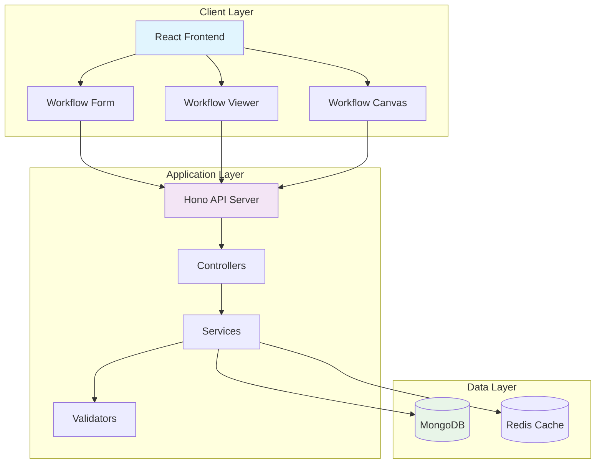
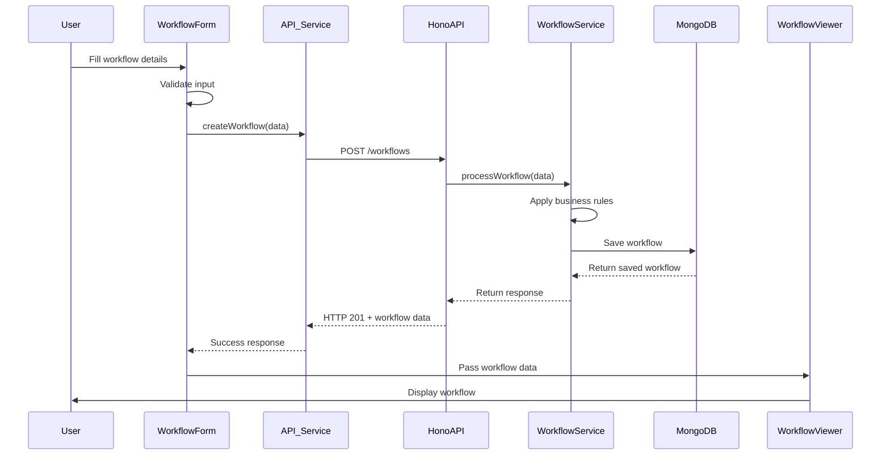
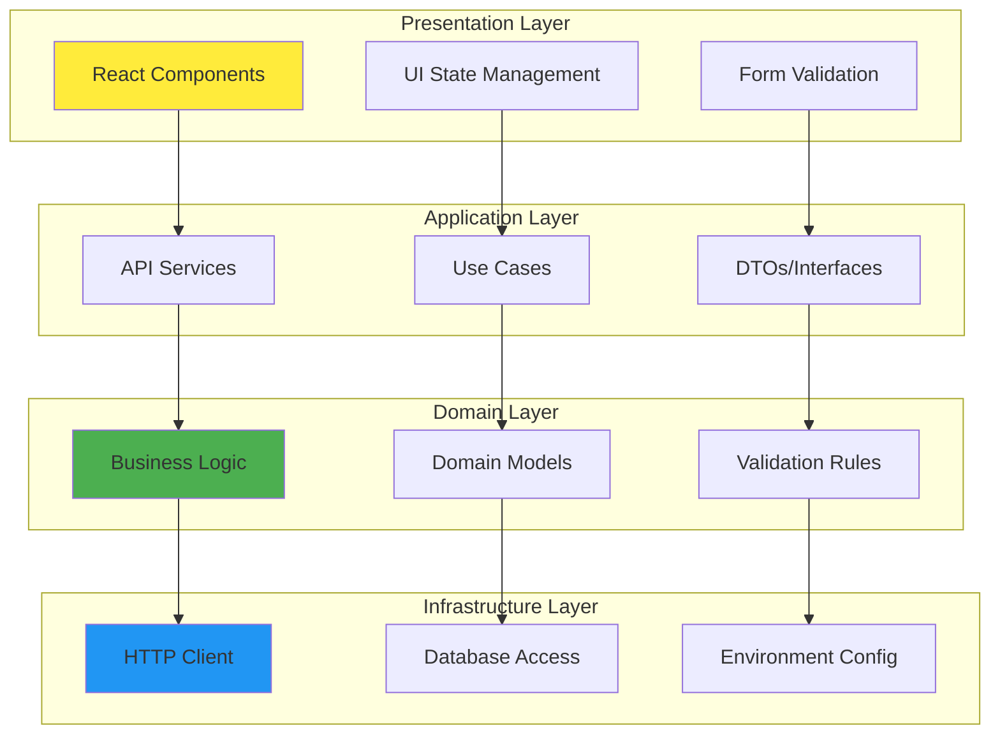
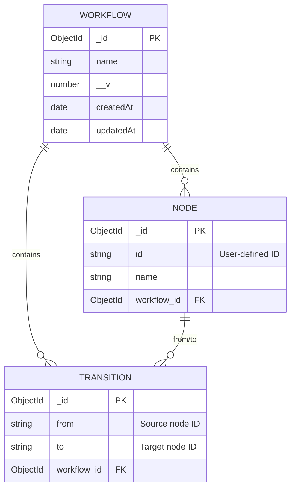
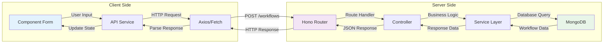
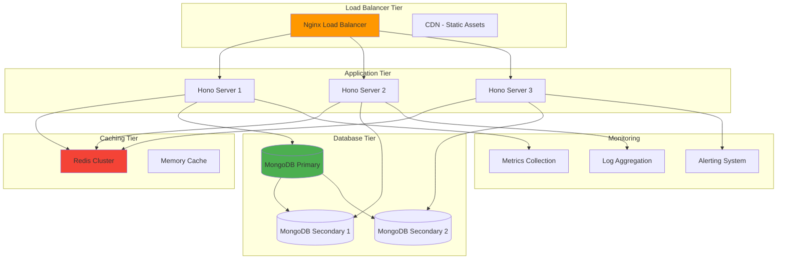
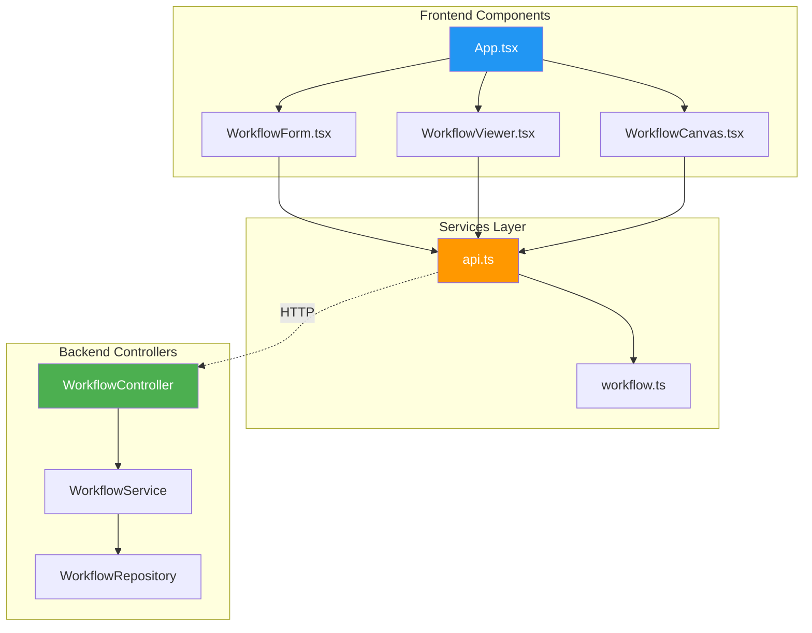
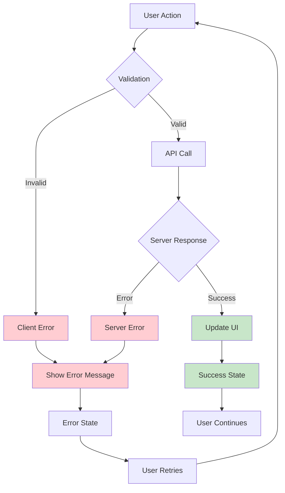

# System Diagrams

## High-Level System Architecture



## Component Data Flow



## Clean Architecture Layers



## Database Schema Design



## API Request/Response Flow



## Finite State Machine (FSM) Model

```mermaid
stateDiagram-v2
    [*] --> StartNode
    StartNode --> TaskNode1
    TaskNode1 --> TaskNode2
    TaskNode2 --> EndNode
    EndNode --> [*]
    
    TaskNode1 --> TaskNode3
    TaskNode3 --> EndNode
    
    note right of StartNode
        Entry point
        No incoming transitions
    end note
    
    note left of EndNode
        Exit point
        No outgoing transitions
    end note
    
    note top of TaskNode2
        Processing nodes
        Have both incoming
        and outgoing transitions
    end note
```

## Scalability Architecture



## Component Interaction Flow



## Error Handling Flow



## Deployment Architecture

```mermaid
graph TB
    subgraph "Development"
        DEV_FE[React Dev Server]
        DEV_BE[Bun Dev Server]
        DEV_DB[(Local MongoDB)]
    end
    
    subgraph "Production"
        PROD_CDN[CDN]
        PROD_LB[Load Balancer]
        PROD_APP[Application Servers]
        PROD_DB[(MongoDB Cluster)]
        PROD_CACHE[(Redis)]
    end
    
    subgraph "CI/CD Pipeline"
        GIT[Git Repository]
        BUILD[Build Process]
        TEST[Test Suite]
        DEPLOY[Deployment]
    end
    
    DEV_FE -.->|Development| GIT
    DEV_BE -.->|Development| GIT
    
    GIT --> BUILD
    BUILD --> TEST
